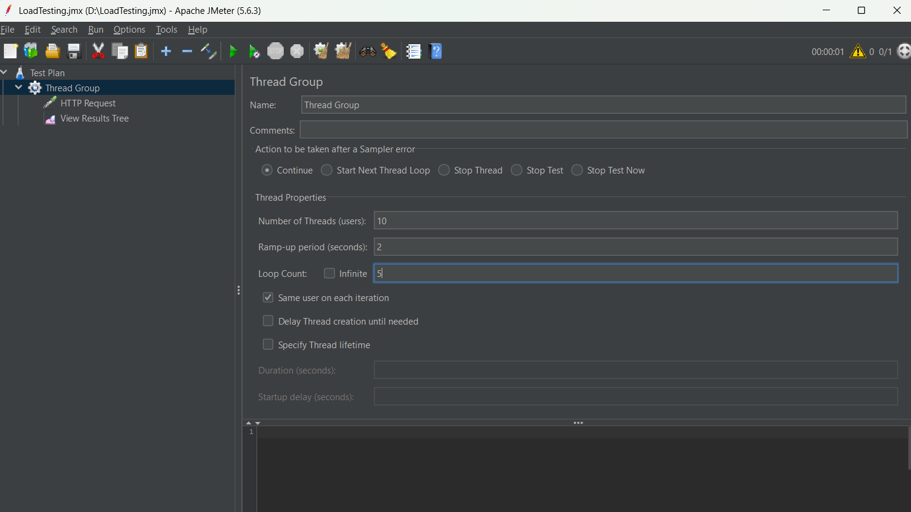
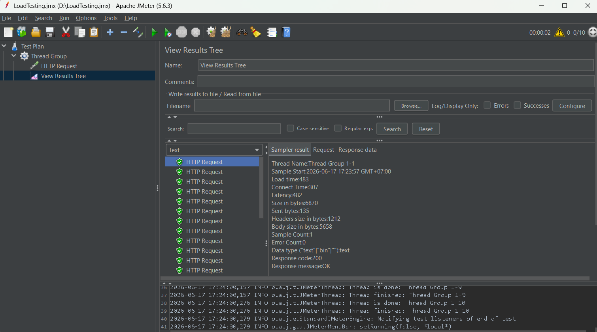
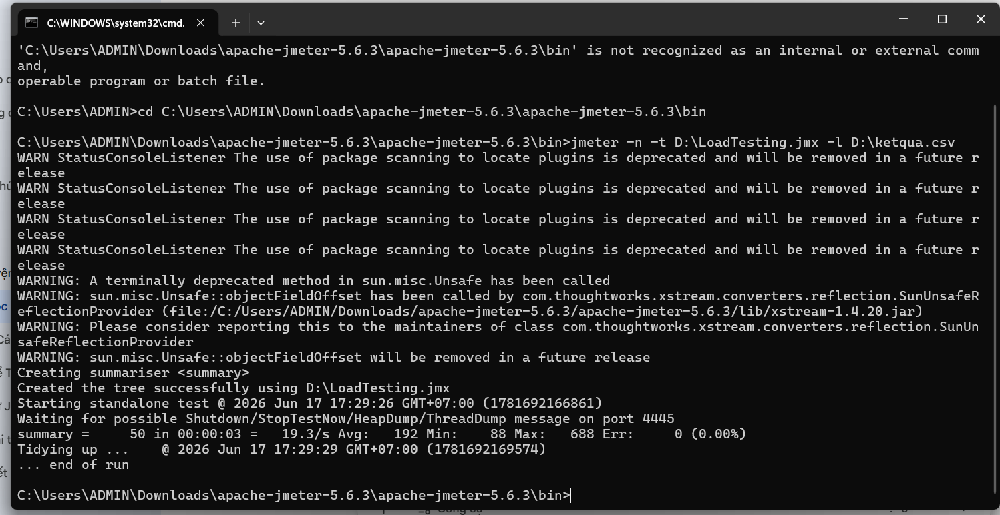

# 🚀 BÁO CÁO KẾT QUẢ KIỂM THỬ HIỆU NĂNG TẢI (LOAD TESTING) BẰNG APACHE JMETER

## 📌 1. THÔNG TIN CHUNG
- **Môn học**: Đánh giá và kiểm thử chất lượng phần mềm
- **Tên bài tập**: Lab thực hành kiểm thử hiệu năng với Apache JMeter
- **Sinh viên thực hiện**: Nguyễn Anh Đức
- **Mã sinh viên**: 23010650

---

## 📚 2. CƠ SỞ LÝ THUYẾT VỀ KIỂM THỬ HIỆU NĂNG

### 2.1. Load Testing (Kiểm thử tải) là gì?
Load Testing là một nhánh quan trọng trong Kiểm thử hiệu năng (Performance Testing). Phương pháp này giúp xác định hành vi và khả năng phản ứng của hệ thống ứng dụng phần mềm khi có một lượng lớn người dùng giả lập truy cập và thực hiện thao tác đồng thời trong cùng một khoảng thời gian cụ thể. 

Mục tiêu chính nhằm tìm kiếm các điểm nghẽn hệ thống (Bottlenecks) liên quan đến phần cứng (CPU, Memory, Network) hoặc lỗi cấu hình phần mềm của máy chủ trước khi đưa sản phẩm lên môi trường thực tế.

### 2.2. Giới thiệu về Apache JMeter
Apache JMeter là một phần mềm mã nguồn mở được viết hoàn toàn bằng ngôn ngữ lập trình Java. JMeter có khả năng giả lập hàng ngàn người dùng ảo (Threads) để tạo tải nặng lên một nhóm các máy chủ mạng, từ đó đo lường hiệu năng xử lý tổng thể của hệ thống đích. 

---

## ⚙️ 3. KỊCH BẢN VÀ THÔNG SỐ KIỂM THỬ

### 3.1. Cấu hình kịch bản mục tiêu
- **Đối tượng kiểm thử**: Mock API Người dùng công cộng.
- **URL đích**: `https://jsonplaceholder.typicode.com/users`
- **Phương thức HTTP**: `GET`

### 3.2. Thiết lập thông số tăng tải (Thread Group Parameters)
Để kiểm tra độ ổn định của hệ thống, kịch bản tải được cấu hình nâng cao bao gồm:
- **Number of Threads (Users)**: 10 người dùng ảo truy cập đồng thời.
- **Ramp-up period (seconds)**: 2 giây (Cứ mỗi 0.2 giây sẽ có thêm 1 user mới được kích hoạt kích hoạt vào hệ thống).
- **Loop Count**: 5 vòng lặp liên tục cho mỗi user.
- **Tổng số Request thực thi giả lập**: 10 (users) x 5 (vòng lặp) = 50 Requests.

---

## 📊 4. QUY TRÌNH THỰC HIỆN VÀ HÌNH ẢNH MINH CHỨNG

### 4.1. Thiết lập các thông số luồng tải trên giao diện GUI
Tiến hành tạo cấu trúc Test Plan, thêm thành phần Thread Group và điền các tham số cấu hình tăng tải giả lập để gửi các gói tin HTTP Request liên tục.

*Hình ảnh minh họa cấu hình Thread Group:*

### 4.2. Thực thi kiểm thử đồ họa (GUI Mode) và Phân tích kết quả
Chạy thử nghiệm kịch bản trực tiếp trên môi trường đồ họa để kiểm tra tính đúng đắn của dữ liệu phản hồi, quan sát các gói tin được xử lý đồng bộ qua Listener View Results Tree.

*Hình ảnh minh họa kết quả kiểm thử trên View Results Tree:*

### 4.3. Kiểm thử hiệu năng tối ưu qua giao diện dòng lệnh (Non-GUI Mode)
Để báo cáo hiệu năng đạt độ chính xác cao nhất không bị ảnh hưởng bởi tài nguyên đồ họa máy máy local, kịch bản được chuyển đổi thực thi trực tiếp bằng Command Line (CMD) và xuất tệp tin thống kê dữ liệu.

*Hình ảnh minh họa màn hình CMD thực thi lệnh thành công:*

---

## 💾 5. HƯỚNG DẪN KIỂM TRA (DÀNH CHO NGƯỜI CHẤM BÀI)
- File kịch bản gốc dữ liệu hình thành cấu trúc kiểm thử: `LoadTesting.jmx`
- File kết quả tổng hợp dữ liệu kiểm thử hệ thống: `ketqua.csv`

Giảng viên có thể import trực tiếp file `.jmx` vào phần mềm JMeter của mình hoặc mở file `.csv` bằng Excel để xem chi tiết thời gian phản hồi (Response Time) của từng request.

## 📝 6. KẾT LUẬN BÀI HỌC
Qua bài tập thực hành Lab JMeter, sinh viên đã làm quen được kỹ năng:
- Hiểu được tầm quan trọng của kiểm thử hiệu năng đối với các hệ thống phần mềm lớn.
- Biết cách thiết lập kịch bản Thread Group, cấu hình tham số tăng tải ảo linh hoạt.
- Thực hành thành thạo kỹ năng chạy load test qua giao diện dòng lệnh không giao diện đồ họa (Non-GUI), giúp tối ưu hóa hiệu suất thiết bị khi thực hiện kiểm thử thực tế.
